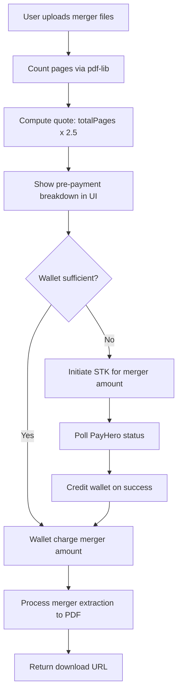

# Fix merger output, pricing, and legal UX

## Goals
- Stop `file-merger` PDFs from including unrelated questions.
- Keep folder cleaner pricing at **1.5 KES/file**.
- Change file merger pricing to **2.5 KES/page** using `pdf-lib` page counting (rounding stays as-is in your existing rounding pipeline).
- Show users explicit pre-payment pricing breakdowns for both services.
- Add tidy-themed footer/legal pages and expose legal routes publicly.

## Root cause and fix strategy (merger relevance bug)
- In [backend/src/utils/GeminiPdfMerger.ts](backend/src/utils/GeminiPdfMerger.ts), extraction currently does batch calls with attached files, then a **second merge-only AI pass** (`mergeBatchResponses`) that receives only text. That second pass can drift and introduce unrelated content.
- The prompt/parse contract is also inconsistent (`itemsHtml` in prompt vs `html` expected in parser).

### Planned fix
- Refactor [backend/src/utils/GeminiPdfMerger.ts](backend/src/utils/GeminiPdfMerger.ts) to:
  - Prefer a **single grounded extraction pass** when possible (or deterministic local merge of batch outputs instead of a creative second AI merge pass).
  - Tighten prompt to strictly return one schema and remove contradictory “JSON + full HTML document” instructions.
  - Make parser read the same schema it asks for (`itemsHtml`, counts, analysis) and reject/guard malformed outputs more safely.
- Keep batching/retry behavior, but eliminate the ungrounded path that can hallucinate unrelated topics.

## Pricing architecture changes

### Shared constants and calculators
- Add dedicated merger pricing constants/calculators:
  - [backend/src/constants](backend/src/constants)
  - [frontend/src/constants](frontend/src/constants)
- Keep cleaner constants unchanged in:
  - [backend/src/constants/cleanerPricing.ts](backend/src/constants/cleanerPricing.ts)
  - [frontend/src/constants/cleanerPricing.ts](frontend/src/constants/cleanerPricing.ts)

### File merger page counting with `pdf-lib` (backend only for merger billing)
- Implement page counting utility using `pdf-lib` in backend merger flow (likely new util under [backend/src/utils](backend/src/utils)).
- In [backend/src/routes/fileMergerRoute.ts](backend/src/routes/fileMergerRoute.ts), compute total pages for uploaded merger PDFs and return/propagate this for billing.
- Ensure page counting only applies to merger billing path, not folder cleaner.

### Wallet + STK parity for merger (selected option)
- Extend payment controller/routes to support merger-specific payment kind and amount based on `pageCount * 2.5`:
  - [backend/src/controllers/payHeroPayment.ts](backend/src/controllers/payHeroPayment.ts)
  - [backend/src/routes/subscription.ts](backend/src/routes/subscription.ts)
  - transaction metadata in existing transaction schema usage.
- Frontend hook currently treats both paid flows as cleaner-per-file in [frontend/src/hooks/useCleaner.ts](frontend/src/hooks/useCleaner.ts); split service-specific cost computation and endpoints for:
  - folder cleaner: `1.5 * fileCount`
  - file merger: `2.5 * totalPageCount`

## UI and legal updates

### Merger and cleaner pre-payment pricing preview
- Update [frontend/src/Pages/Merger.tsx](frontend/src/Pages/Merger.tsx) to show:
  - rate: `2.5 KES/page`
  - pre-pay breakdown: `pageCount × 2.5`, rounded total.
- Keep [frontend/src/Pages/Cleaner.tsx](frontend/src/Pages/Cleaner.tsx) on `1.5 KES/file`, and ensure wording says “per file”.
- Update homepage “interactive preview” in [frontend/src/Pages/WelcomePage.tsx](frontend/src/Pages/WelcomePage.tsx) with both service pricing examples:
  - folder cleaner: `1.5/file`
  - file merger: `2.5/page`

### Footer + legal pages + support email
- Create public legal pages:
  - [frontend/src/Pages/PrivacyPolicy.tsx](frontend/src/Pages/PrivacyPolicy.tsx)
  - [frontend/src/Pages/TermsOfService.tsx](frontend/src/Pages/TermsOfService.tsx)
- Register as **public routes** in [frontend/src/App.tsx](frontend/src/App.tsx).
- Update tidy-themed footer on [frontend/src/Pages/WelcomePage.tsx](frontend/src/Pages/WelcomePage.tsx) to include links to Privacy/Terms.
- Ensure support email shown on homepage/legal content is `phinjugushdev@gmail.com`.

## Validation and safety checks
- Verify no regression in existing cleaner charge flow.
- Verify merger charge amount from page count matches preview shown before user confirms payment.
- Smoke test both wallet-covered and STK-top-up paths for merger.
- Run lints on touched frontend/backend files and fix introduced issues.

## Flow diagram

